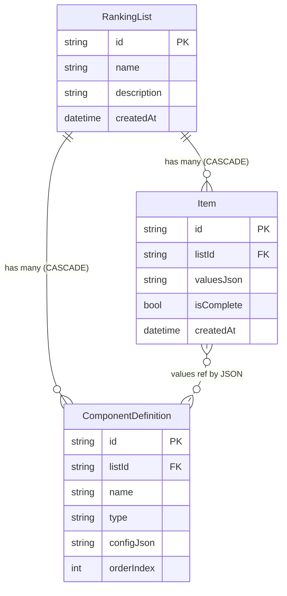
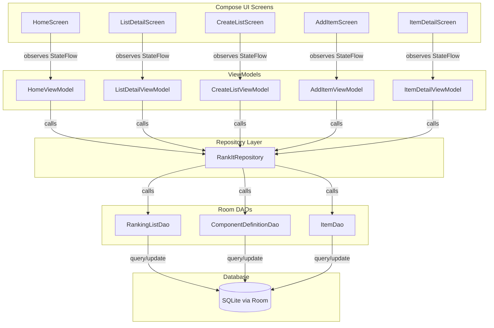
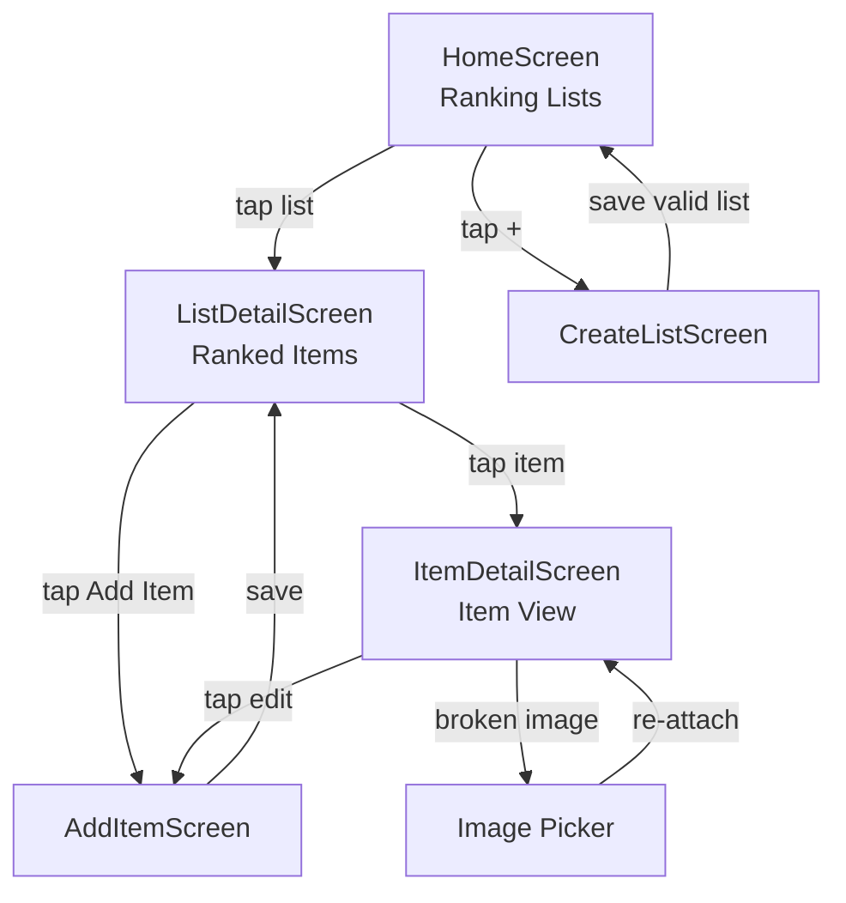

# RankIt — Architecture Decision Record

**Status**: Accepted

## Context

No existing mobile app provides flexible, schema-per-list ranking with custom scoring categories. Users currently track ranked lists manually in notes. The app must:

- Allow users to define any list type with fully custom fields (text, image, slider, description, location)
- Support per-list independent schemas where sliders can optionally contribute to a computed score
- Rank items by the mean of their scoring sliders, with sort-by-category support
- Operate fully offline (local-only) in v1
- Be extensible toward friend sharing and recommendations in future versions
- Serve as a learning project for a developer new to Android (Python background)

**Constraints**: Local-only (no backend), hundreds of items per list at most, learning-oriented architecture choices.

## Decision

### UI Framework: Jetpack Compose

Modern declarative UI toolkit, Kotlin-native, Google's current standard. Aligns with React mental model the developer already has. All new Android development uses Compose — investment is future-proof.

**Sacrifice**: Steeper initial learning curve vs XML/Views.

### Storage: Room/SQLite

Type-safe, queryable, standard Android persistence. Supports `ForeignKey(onDelete = CASCADE)` for clean cascading deletes. Scales naturally to sync/export for future sharing.

**Sacrifice**: More boilerplate than JSON files.

### Data Model: Hybrid

ComponentDefinitions stored in structured Room tables (fully typed, queryable). Item values stored as a JSON blob per item. One row per item — simple reads and writes. Sorting is done in Kotlin after loading, not in SQL.

**Rationale**: Full EAV (Entity-Attribute-Value) would require complex joins to reconstruct a single item. Full JSON files would make querying painful. Hybrid gives simplicity for v1 scale while keeping schema metadata structured and evolvable.

### Architecture: MVVM + Repository

Industry-standard Android pattern. View (Compose) observes StateFlow from ViewModel. ViewModel calls Repository. Repository calls Room DAOs. ViewModels survive screen rotation; draft state for in-progress forms lives in ViewModel, not Compose local state.

### Images: File Path in App-Local Storage

Images saved to app's internal storage directory. Only the file path stored in `valuesJson`. Avoids binary blob bloat in SQLite. Future sharing exports image files alongside data.

### UI Navigation: 5 Screens

## Consequences

**Positive:**
- Modern, extensible stack — every choice maps to future sharing and recommendation features
- MVVM + Repository makes the data layer swappable (local → remote) without touching UI
- Hybrid model keeps item reads/writes simple — one row, one JSON blob
- Compose declarative UI maps naturally to developer's React experience
- Cascading deletes via Room FK ensure zero orphaned rows

**Negative:**
- Sorting/filtering by score or category requires loading items into memory (Kotlin-side)
- JSON blob in `valuesJson` is not directly queryable by SQL — future analytics would need parsing
- More upfront boilerplate than a JSON-file approach

**Mitigations:**
- At v1 scale (hundreds of items), in-memory sorting is negligible on modern phones
- Schema evolution handled eagerly: when ComponentDefinitions change, all item `valuesJson` blobs are updated and `isComplete` recomputed
- Validation enforces ≥1 scoring slider at list creation AND schema edit time (prevents null-score division)
- Broken image paths: UI shows emoji placeholder + option to re-attach; null scores sort last (no crash)
